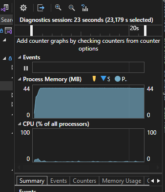

# 🚀 **POC Sprite Animation in WPF**

## 🛠 **Teknologi yang Dipakai**
- **.NET 6**
- **WPF (MVVM Pattern)**
- **WriteableBitmap** → Optimasi frame update
- **CompositionTarget.Rendering** → Animasi smooth
- **Sprite Pooling** → Efisiensi memori

---

## 🎬 **Awal Mula: GIF vs Sprite Sheet**
Gw butuh animasi loading tanpa GIF, jadi pakai **sprite sheet**. Gw pilih sprite sheet karena ini teknik lama yang banyak dipakai di aplikasi desktop sebelum GIF bisa di-handle dengan baik.. Awalnya pakai **CroppedBitmap**, tapi memori naik terus karena alokasi objek baru tiap frame. 😵

Animasi jalan, tapi masalahnya memori terus naik. Setelah dicek, ternyata tiap update frame bikin objek baru, dan itu bikin alokasi memori numpuk.


Btw, gw pakai MVVM sesuai dengan arsitektur WPF umumnya.

---

## 🔧 **Optimasi dengan WriteableBitmap**
✅ **WriteableBitmap** memungkinkan update tanpa alokasi baru. Namun, tetap ada naik-turun memori karena:
- **GC masih berjalan** 🔄
- **WPF pakai Deferred Rendering** 🖼️
- **WritePixels() tetap butuh buffer sementara** 📌

📌 **Solusi:**
- Set **`RenderOptions.BitmapScalingMode="NearestNeighbor"`** (mengurangi overhead smoothing).
- Gunakan **`DispatcherPriority.Render`** buat timer biar pas dengan WPF rendering.
- **Reuse `WriteableBitmap`**, jangan buat baru tiap frame.

📊 **Hasilnya**: Memori lebih stabil, CPU tetap 1-2% (wajar buat animasi ringan).


---

## 🚀 **Level Up: CompositionTarget.Rendering**
> **Masalah:** `DispatcherTimer` bikin animasi **kadang stutter**. 😡

✅ **Solusi:** Pakai **`CompositionTarget.Rendering`** biar sync langsung ke refresh rate layar. Hasilnya **super smooth, bebas stutter!** 🔥

```csharp
CompositionTarget.Rendering += UpdateFrame;
```

📊 **Keuntungan:**
- **Langsung sync ke layar** → Animasi **ultra smooth** 🚀
- **Bebas frame drop & cegukan** 🔄
- **Support 30 FPS dengan frame skip** 📉

```csharp
if (frameRate == FrameRate.FPS30 && frameSkip % 2 != 0)
{
    frameSkip++;
    return;
}
```


---

## 🖼️ **Sprite Animation dengan Pooling**
Sebelumnya, tiap update bikin **bitmap baru** ➝ Memori boros! 😱

✅ **Solusi:** Pakai **`SpritePool`** buat reuse bitmap. 📌

| Sebelum ❌ | Sekarang ✅ |
|-----------|-----------|
| **Bitmap baru tiap frame** | **Pakai `SpritePool`, reuse bitmap!** |
| **Lama-lama ngelag** | **Sekarang lebih stabil, gak ada beban tambahan!** |

📌 **Cara Pakai di XAML:**
```xml
<Image Width="64" Height="64" Source="{Binding LoadingSprite.SpriteFrame}" Margin="30,30">
    <Image.RenderTransform>
        <RotateTransform Angle="{Binding LoadingSprite.RotationAngle}" CenterX="32" CenterY="32"/>
    </Image.RenderTransform>
</Image>
```



---

## 🎯 **Kesimpulan**
✅ **Dari `CroppedBitmap` ➝ `WriteableBitmap` ➝ `CompositionTarget.Rendering`**
✅ **Memori lebih stabil, CPU lebih rendah**
✅ **Animasi ultra smooth, bisa 30 atau 60 FPS**
✅ **Sprite pooling bikin alokasi memori lebih efisien**

🔥 **Sekarang animasi jalan lebih smooth, efisien, dan fleksibel!** 🚀

