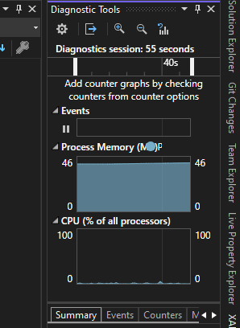

# **POC Animation with Sprite in WPF**

# **Teknologi yang Dipakai**
- **.NET 6**
- **WPF (Windows Presentation Foundation)**
- **MVVM Pattern**
- **WriteableBitmap buat optimasi frame update**
- **DispatcherTimer buat update animasi**

---

# **Kesimpulan Gw Sampai Sekarang**

## **Awal Mula**
Awalnya, gw mau bikin animasi loading di WPF tanpa GIF. Gw pilih sprite sheet karena ini teknik lama yang banyak dipakai di aplikasi desktop sebelum GIF bisa di-handle dengan baik. Supaya lebih rapi, gw pakai MVVM, jadi nggak ada code-behind.

Di awal implementasi, gw pakai **`CroppedBitmap`** buat motong frame dari sprite sheet. Animasi jalan, tapi masalahnya memori terus naik. Setelah dicek, ternyata tiap update frame bikin objek baru, dan itu bikin alokasi memori numpuk.

## **Optimasi dengan WriteableBitmap**
Gw coba ganti pendekatan pakai **`WriteableBitmap`**, biar bisa update gambar langsung tanpa bikin objek baru. Hasilnya lebih bagus, tapi tetap ada naik-turun di penggunaan memori. Setelah gw selidiki, ada beberapa penyebabnya:
- **GC masih jalan**, jadi naik turunnya karena alokasi kecil yang dibersihin.
- **WPF pakai Deferred Rendering**, jadi ada cache tambahan sebelum gambar ditampilkan.
- **`WritePixels()` tetap butuh buffer sementara**, jadi tetap ada sedikit alokasi tiap frame.


Terus, CPU juga kelihatan naik-turun di angka 1-2%. Setelah gw pikir-pikir, ini wajar karena tiap frame tetap butuh proses buat update tampilan. Biar lebih efisien, gw coba beberapa optimasi:
- **Set `RenderOptions.BitmapScalingMode="NearestNeighbor"`** biar nggak ada overhead dari smoothing.
- **Timer diubah ke `DispatcherPriority.Render`** biar pas dengan rendering WPF.
- **Pastikan `WriteableBitmap` di-reuse**, bukan bikin baru tiap frame.

Setelah optimasi ini, memori masih naik turun, tapi turun lagi setelah GC jalan. CPU juga tetap di 1-2%, yang masih masuk akal buat animasi ringan. **Intinya, performanya udah jauh lebih stabil dan nggak ada kebocoran memori.**

## **Buffering Tambahan**
Gw notice kalau dengan pendekatan sebelumnya memanfaatkan `DispatcherTimer` yang terus menerus men-generate gambar, dan itu makan resource, baik memori maupun CPU. Maka dari itu, pendekatan selanjutnya adalah melakukan **preload gambar ke buffer** sebelum animasi mulai jalan.

Keuntungan buffering:
- **Mengurangi alokasi memori tiap frame** karena gambar sudah ada di buffer.
- **CPU usage lebih stabil**, karena nggak perlu ngambil ulang dari `WriteableBitmap` setiap waktu.
- **GC lebih minim**, karena nggak ada objek baru yang terus dialokasikan.

Setelah implementasi buffering ini, **memori lebih stabil dan CPU usage turun sedikit** dibanding sebelumnya. Gw rasa ini pendekatan yang paling optimal buat animasi sprite di WPF.


---

# Update 15 Maret 2025: Peralihan ke CompositionTarget.Rendering untuk Animasi Super Smooth

## Kenapa Gw Lakuin Ini?
Awalnya, animasi jalan di **60 FPS** pakai `DispatcherTimer`, tapi kadang suka ada **cegukan** (stutter). Gw ganti ke **`CompositionTarget.Rendering`**, yang langsung sync ke refresh rate layar. Hasilnya? **Super smooth, bebas stutter!**

Tapi ada hal yang harus Gw pikirin:

1. **Gak semua animasi butuh 60 FPS** → Kadang 30 FPS udah cukup, lebih hemat performa.
2. **Harus tetap fleksibel** → Biar gampang atur FPS tanpa ribet.

Jadi, perubahan ini gak cuma bikin animasi lebih smooth, tapi juga kasih opsi buat jalan di 30 FPS kalau emang dibutuhkan.

---

## Perubahan Utama:
### 1. **Ganti ke CompositionTarget.Rendering**
Daripada pakai `DispatcherTimer`, Gw sekarang pakai **`CompositionTarget.Rendering`** buat nge-render animasi:

```csharp
CompositionTarget.Rendering += UpdateFrame;
```

Kenapa ini lebih baik?
- **Langsung sync ke refresh rate layar** → Bebas dari delay yang kadang ada di `DispatcherTimer`.
- **Lebih smooth & stabil** → Gak ada lagi frame drop atau cegukan random.



---

### 2. **Frame Skip buat 30 FPS**
Karena layar biasanya refresh di 60 Hz, Gw pakai trik **frame skip** buat 30 FPS:
```csharp
if (frameRate == FrameRate.FPS30 && frameSkip % 2 != 0)
{
    frameSkip++;
    return;
}
```
Ini bikin animasi tetep **smooth tanpa dipaksa jalan tiap frame**, lebih hemat performa.

---

### 3. **Tambahin Enum buat Opsi FPS**
Gw juga bikin **enum `FrameRate`**, biar gampang pilih FPS yang diinginkan:

```csharp
public enum FrameRate
{
    FPS30,
    FPS60
}
```
Sekarang gampang milih FPS:
```csharp
var sprite60FPS = new LoadingSprite(FrameRate.FPS60);
var sprite30FPS = new LoadingSprite(FrameRate.FPS30);
```

---

## Hasil Akhir
- **60 FPS**: Animasi jalan tiap frame rendering, ultra smooth.
- **30 FPS**: Tetep smooth tanpa dipaksa jalan tiap frame, lebih hemat performa.
- **Bebas cegukan**: Karena sync langsung ke layar pakai `CompositionTarget.Rendering`.

Sekarang tinggal pilih FPS yang lu butuhin tanpa ribet! 🚀🔥

