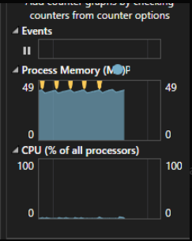
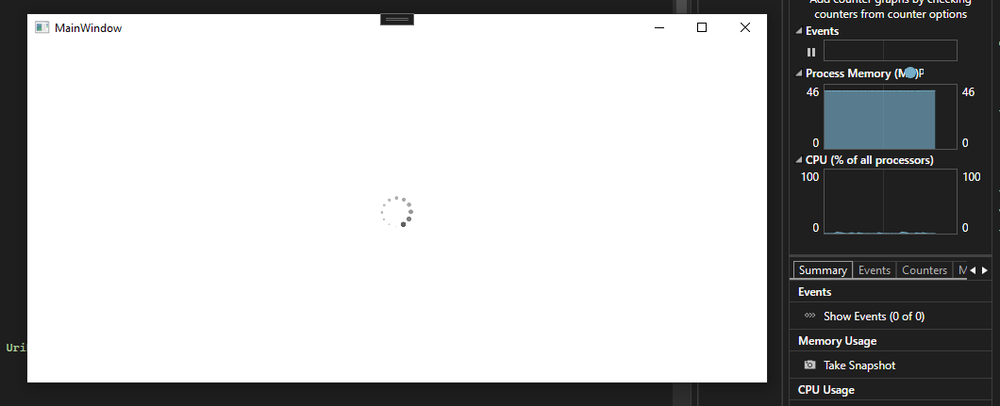

# **Kesimpulan Gw Sampai Sekarang**

## **Awal Mula**
Awalnya, gw mau bikin animasi loading di WPF tanpa GIF. Gw pilih sprite sheet karena ini teknik lama yang banyak dipakai di aplikasi desktop sebelum GIF bisa di-handle dengan baik. Supaya lebih rapi, gw pakai MVVM, jadi nggak ada code-behind.

Di awal implementasi, gw pakai **`CroppedBitmap`** buat motong frame dari sprite sheet. Animasi jalan, tapi masalahnya memori terus naik. Setelah dicek, ternyata tiap update frame bikin objek baru, dan itu bikin alokasi memori numpuk.

## **Optimasi dengan WriteableBitmap**
Gw coba ganti pendekatan pakai **`WriteableBitmap`**, biar bisa update gambar langsung tanpa bikin objek baru. Hasilnya lebih bagus, tapi tetap ada naik-turun di penggunaan memori. Setelah gw selidiki, ada beberapa penyebabnya:
- **GC masih jalan**, jadi naik turunnya karena alokasi kecil yang dibersihin.
- **WPF pakai Deferred Rendering**, jadi ada cache tambahan sebelum gambar ditampilkan.
- **`WritePixels()` tetap butuh buffer sementara**, jadi tetap ada sedikit alokasi tiap frame.

Terus, CPU juga kelihatan naik-turun di angka 1-2%. Setelah gw pikir-pikir, ini wajar karena tiap frame tetap butuh proses buat update tampilan. Biar lebih efisien, gw coba beberapa optimasi:
- **Set `RenderOptions.BitmapScalingMode="NearestNeighbor"`** biar nggak ada overhead dari smoothing.
- **Timer diubah ke `DispatcherPriority.Render`** biar pas dengan rendering WPF.
- **Pastikan `WriteableBitmap` di-reuse**, bukan bikin baru tiap frame.

Setelah optimasi ini, memori masih naik turun, tapi turun lagi setelah GC jalan. CPU juga tetap di 1-2%, yang masih masuk akal buat animasi ringan. **Intinya, performanya udah jauh lebih stabil dan nggak ada kebocoran memori.**

## **Buffering Tambahan**
Gw notice kalau dengan pendekatan sebelumnya memanfaatkan `DispatcherTimer` yang terus menerus men-generate gambar, dan itu makan resource, baik memori maupun CPU. Maka dari itu, pendekatan selanjutnya adalah melakukan **preload gambar ke buffer** sebelum animasi mulai jalan.

Keuntungan buffering:
- **Mengurangi alokasi memori tiap frame** karena gambar sudah ada di buffer.
- **CPU usage lebih stabil**, karena nggak perlu ngambil ulang dari `WriteableBitmap` setiap waktu.
- **GC lebih minim**, karena nggak ada objek baru yang terus dialokasikan.

Setelah implementasi buffering ini, **memori lebih stabil dan CPU usage turun sedikit** dibanding sebelumnya. Gw rasa ini pendekatan yang paling optimal buat animasi sprite di WPF.

## **Teknologi yang Dipakai**
- **.NET 6**
- **WPF (Windows Presentation Foundation)**
- **MVVM Pattern**
- **WriteableBitmap buat optimasi frame update**
- **DispatcherTimer buat update animasi**

---

Kalau ada update lagi, gw bakal revisi kesimpulan ini. Sejauh ini, hasilnya udah cukup memuaskan! 🚀
